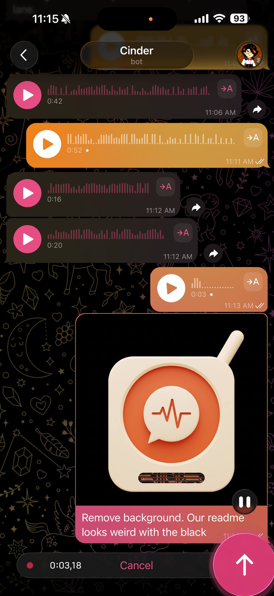

<p align="center">
  
</p>

# Booth

> Voice for the AI agent in your pocket.

I started messaging my agent constantly when I wasn't at my computer — phone, parking lot, between meetings. Texting worked, but voice was what I actually wanted. Half the time my hands were full or my eyes were on something else.

So I built it. Booth turns my agent's replies into real voice notes on Telegram, and transcribes mine on the way back. Round-trip in a few seconds, in the same chat I was already in.

The picture in my head: my agent at a radio booth, broadcasting from a back room while I'm out running my life. Dispatching my AI workflows. Watching the shop. Picking up when I call.

That's where the name came from.

<p align="center">
  
  <br/>
  <em>What it actually looks like — voice notes back and forth with your agent, on the phone you already have.</em>
</p>

## What Booth is, in plain English

A small Mac menu-bar app + a tiny command-line tool. It drops in next to whatever Telegram-to-AI setup you already use — your existing chat bot keeps doing chat, Booth adds **voice** on both ends.

- When your agent wants to reply with voice, it calls `booth say "..."`. A real voice note shows up on your phone in about three seconds.
- When you send a voice note, your agent hands the audio file to `booth transcribe` and gets the text back.

All of it runs on your Mac. No API keys, no cloud bills, no subscription. Free forever. Voice synthesis happens on the Apple Neural Engine via [Kokoro](https://github.com/thewh1teagle/kokoro-onnx); transcription happens via [whisper.cpp](https://github.com/ggerganov/whisper.cpp).

## Prerequisites

Booth is the voice layer **on top of** an existing Telegram bridge — it doesn't bridge Telegram itself. Before installing Booth you need:

1. **A Mac** running macOS 13+ (Apple Silicon strongly recommended).
2. **Homebrew** installed — [brew.sh](https://brew.sh).
3. **Xcode Command Line Tools** — needed for the menu-bar app build. Run `xcode-select --install` if you've never installed them. Most folks running an AI coding agent already have these.
4. **A Telegram bot token.** If you don't have one, the [5-minute walkthrough in `docs/BOT_SETUP.md`](docs/BOT_SETUP.md) gets you one via `@BotFather`.
5. **A Telegram MCP bridge wired into your AI agent.** Booth assumes inbound text + voice messages already arrive in your agent's context via someone else's plugin. Pick one:
   - **Claude Code** *(recommended, primary supported path)*: Anthropic's official Telegram channel plugin — `claude-plugins-official` — installs in one command and exposes `<channel source="plugin:telegram:telegram">` blocks for incoming messages. Repo: [anthropics/claude-plugins-official](https://github.com/anthropics/claude-plugins-official). After install, launch your Claude Code session with `claude --channels plugin:telegram@claude-plugins-official` (the `--channels` flag is what activates the bridge). Use `/telegram:access` from inside the session to pair your phone.
   - **Codex CLI**: [TeleCodex](https://github.com/benedict2310/telecodex) is the closest equivalent.
   - **OpenClaw**: built-in Telegram skill — see [docs.openclaw.ai/channels/telegram](https://docs.openclaw.ai/channels/telegram).
   - **Custom agent**: anything that polls `getUpdates` on your bot token and feeds the message into your agent's context will work. Booth never polls — it only sends voice and transcribes audio your agent already has.

Once your agent receives Telegram messages and can reply with text, you're ready for Booth.

## Install

One line, every Mac:

```bash
curl -fsSL https://raw.githubusercontent.com/blazemalan/booth/main/install.sh | bash
```

The installer clones the repo into `~/.local/share/booth/repo`, downloads the Kokoro TTS + Whisper STT models (~320 MB total), builds and installs `Booth.app` to `/Applications/`, drops the `booth` CLI on your PATH at `~/.local/bin/booth`, and prompts you for your Telegram bot token. Five minutes start to finish on a warm internet connection.

After install, open a new terminal so the PATH change takes effect, set your default chat:

```bash
echo 'YOUR_CHAT_ID' >> ~/.local/share/booth/chat_ids
```

(see [`docs/BOT_SETUP.md`](docs/BOT_SETUP.md) for finding your chat ID), and verify with:

```bash
booth say "hello"
```

You should see a real voice bubble pop up on your phone.

### Have an AI agent? Paste this.

If you have an AI coding agent on this Mac (Claude Code, Codex CLI, OpenClaw, custom), tell it to install Booth for you:

> **Install Booth for me.** Run `curl -fsSL https://raw.githubusercontent.com/blazemalan/booth/main/install.sh | bash`. Then drop my Telegram bot token at `~/.local/share/booth/telegram_bot_token` (mode 600) and my default chat ID at `~/.local/share/booth/chat_ids` (one per line). Wire the `booth.md` voice protocol file so you re-read it on every incoming voice message — if you're Claude Code, run `~/.local/share/booth/repo/scripts/install_claude_hook.sh` to set up the UserPromptSubmit hook automatically. Codex CLI / OpenClaw / custom agents: import `~/.local/share/booth/booth.md` however your system handles agent context. Verify with `booth say "hello"` (synthesizes + sends a real voice bubble) before reporting success.

The agent runs the installer, wires the hook, sends a verification voice message, and you're done.

## How it fits

You probably already have a Telegram bridge wired into your agent:

- [Claude Code Channels](https://github.com/anthropics/claude-plugins-official) — Anthropic's official MCP plugin
- [OpenClaw Telegram skill](https://docs.openclaw.ai/channels/telegram) — 8.3k+ installs
- [Ductor](https://github.com/PleasePrompto/ductor) — Claude Code + Codex + Gemini in one bridge
- [TeleCodex](https://github.com/benedict2310/telecodex) — Codex CLI bridge
- [Composio's Telegram MCP](https://composio.dev/toolkits/telegram) — generic agent bridge

These all do the same job well: they pipe text between Telegram and your local agent. Booth doesn't compete with them — Booth gives them voice.

```
[your phone]                                 [your Mac]
                                                   │
text msg ──► your bridge ────────► your agent ◄──┤
                                                   │
voice note ►► your bridge ──► booth transcribe ──►│
                                                   │
                          your agent ──► booth say ──► sendVoice ──► your phone
```

Your bridge handles the chat. Booth handles voice on both ends. They share a bot, but Booth never polls `getUpdates`, so there's no conflict.

## What it does

- **Outbound voice:** your agent calls `booth say "..."`. Booth synthesizes the audio (locally via [Kokoro-onnx](https://github.com/thewh1teagle/kokoro-onnx) on the Apple Neural Engine, or remotely via ElevenLabs — your choice, see [Backends](#backends)), encodes Opus, posts to Telegram's `sendVoice`. Your phone buzzes with a real voice bubble in ~2.5 seconds.
- **Inbound transcription:** when your bridge delivers a voice note (with the audio file path), your agent calls `booth transcribe path.oga` and gets the text from [whisper.cpp](https://github.com/ggerganov/whisper.cpp). Local, fast, free.
- **Self-trigger (Claude Code only):** `booth inject "/compact"` AppleScripts the slash command into your front Terminal session — useful when you're not at the keyboard but your agent's running long.

## Backends

Booth ships with two synthesis backends. Pick one at install time, swap any time by editing `$BOOTH_HOME/config.json`.

| | Kokoro *(default)* | ElevenLabs |
|---|---|---|
| Cost | free | paid (~$5/mo for ~100 min of speech, more on higher tiers) |
| Where it runs | local, on your Mac | ElevenLabs's servers, HTTP |
| First-call latency | ~3–4s cold (model load), ~0.7–1.0s warm | ~75ms model + network round-trip |
| Voice catalogue | ~50 voices that ship with Kokoro | whatever's in your ElevenLabs account |
| Daemon | shared 290 MB process keeps Kokoro hot | none — direct HTTP, nothing to keep loaded |
| API key needed | no | yes — see [elevenlabs.io](https://elevenlabs.io) |

**Pick Kokoro** if you want zero monthly cost, no API key, and Kokoro's voice roster is good enough.

**Pick ElevenLabs** if you've created or chosen a specific voice on your ElevenLabs account that you want your agent to use, or you need a language/accent Kokoro doesn't ship.

The same `booth say` command works for both. Backend is one config key.

```json
// $BOOTH_HOME/config.json
{
  "backend": "elevenlabs",
  "elevenlabs": {
    "voice_id": "21m00Tcm4TlvDq8ikWAM",
    "model": "eleven_flash_v2_5"
  }
}
```

When the backend is `elevenlabs`, drop your API key at `$BOOTH_HOME/elevenlabs_api_key` (mode 600). Voice id and model live in `config.json` so you can swap voices without touching code.

**On failures:** Booth fails *loud* on quota exhaustion, invalid keys, or network errors. It does not silently fall back to Kokoro. Voice identity is the contract — silently swapping engines mid-conversation would break it. The calling agent decides what to do on a failed call: drop, retry, or fall back to a text reply.

> *"Voice quality and voice identity are different problems."*

That's why two backends exist. They make different trade-offs on each axis.

## Why Telegram (and not iMessage)

Telegram has a real Bot API with first-class voice-bubble support and a clean `sendVoice` endpoint. iMessage doesn't:

- No native voice bubble for bots. AppleScript sends an audio attachment, which arrives as "tap to play this file," not the proper waveform voice bubble.
- No inbound API. Receiving an iMessage programmatically means polling SQLite or wrestling with AppleScript event handlers. Brittle and slow.
- macOS TCC sandboxing keeps blocking automation paths Apple used to allow. Every macOS update is a new fight.

We may add an iMessage adapter later, but the experience will be a downgrade. Telegram is the intended channel.

## Who it's for

People running an always-on AI coding agent locally — Claude Code, Codex CLI, OpenClaw, custom Python — who already have a Telegram bridge and want to actually *talk* to their agent from anywhere.

## Manual install

If you'd rather clone the repo yourself instead of piping the installer:

```bash
git clone https://github.com/blazemalan/booth.git
cd booth
./install.sh
```

Either path runs the same `install.sh`. It:

- Downloads Kokoro TTS models (~196 MB) to `~/.local/share/kokoro-tts/`
- Downloads Whisper.cpp base model (~150 MB) to `~/.local/share/whisper/`
- Creates a runtime venv at `~/.local/share/booth/.venv` with the synth + STT deps
- Builds `Booth.app` and copies it to `/Applications/`
- Symlinks the `booth` CLI into `~/.local/bin/booth` and adds that dir to your shell PATH if it isn't already
- Asks for your Telegram bot token (one-time)

You'll need a Telegram bot token. Two paths:

- **Already have a bot wired into your bridge?** Use the same token — Booth doesn't poll `getUpdates`, so no conflict.
- **Don't have one yet?** [Five-minute walkthrough in `docs/BOT_SETUP.md`](docs/BOT_SETUP.md).

## Multiple agents on one Mac

Running more than one AI agent that needs voice (e.g. Cinder + Hans + a third)? Each agent sends through its **own** Telegram bot — otherwise replies all show up in the same chat thread and identities cross-wire.

Booth supports this via the `BOOTH_HOME` env var. The default state dir is `~/.local/share/booth/`. Override per-agent and the agent picks up its own bot token + chat config — but the heavy stuff (Kokoro voice daemon, model files, runtime venv, the menu-bar app) is **shared** across every bot. So bot #2 doesn't cost another ~290 MB of RAM, and bot #3 doesn't either. The daemon does pure text-to-audio synthesis with no notion of bot identity; whichever bot's `booth say` made the call uses its own token to upload the result.

```bash
# 1. Make a bot for the second agent in @BotFather, get its token.
# 2. Spin up the agent's Booth state dir (per-agent identity only):
mkdir -p ~/.local/share/booth-agent2
echo "ITS_BOT_TOKEN" > ~/.local/share/booth-agent2/telegram_bot_token
chmod 600 ~/.local/share/booth-agent2/telegram_bot_token
echo "YOUR_CHAT_ID" > ~/.local/share/booth-agent2/chat_ids
cp ~/.local/share/booth/booth.md ~/.local/share/booth-agent2/booth.md
```

Then in the agent's project, set the env var so its `claude` session picks it up. For Claude Code, add to `<project>/.claude/settings.json`:

```json
{
  "env": {
    "BOOTH_HOME": "/Users/you/.local/share/booth-agent2"
  }
}
```

Now `booth say` from that agent's session sends through *its* bot, lands in *its* thread. The voice daemon socket lives in the per-user temp dir, shared by every Booth client on the Mac.

**What's per-agent (lives in `$BOOTH_HOME`):**
- `telegram_bot_token`
- `chat_ids`
- `booth.md` (voice protocol)

**What's shared (lives outside `$BOOTH_HOME`):**
- The voice daemon (one process serves every bot)
- Kokoro TTS models, Whisper STT model, runtime venv, `Booth.app`

## System requirements

- **Mac:** Apple Silicon (M1, M2, M3, M4) recommended. Intel Macs work but TTS synthesis is 3–5× slower.
- **macOS:** 13.0 (Ventura) or newer.
- **RAM:** 8 GB minimum, 16 GB recommended.
- **Disk:** ~1 GB free (models + app bundle).
- **Permissions:** Accessibility (for `booth inject`).

## Voices

Kokoro ships 50+ voices, graded A through F by the model author. Booth defaults to `af_heart` — the only A-grade voice in the roster. Swap with `--voice af_bella` etc.

ElevenLabs has its own voice catalogue under your account — voice ids look like `21m00Tcm4TlvDq8ikWAM`. Set the default in `$BOOTH_HOME/config.json`'s `"elevenlabs": {"voice_id": "..."}` field, or override per-call with `--voice`.

## Troubleshooting

**Kokoro daemon keeps idling out** — if you've set `backend: elevenlabs` and never call Kokoro, the daemon will exit cleanly after 30 minutes idle. That's correct behaviour, not a bug. The next Kokoro call (if you switch back) auto-respawns it.

**ElevenLabs returned 401 / 429 / network error** — Booth fails loud on these by design. Check `$BOOTH_HOME/elevenlabs_api_key` is set and your account has credits. If you want continuity over identity, your *agent* is the right place to catch the failure and fall back (e.g. send a text reply instead) — Booth itself will not silently switch to Kokoro.

**Voice bubble shows up as a tap-to-play file instead of a waveform** — `opus-tools` may not be installed. `brew install opus-tools` and try again.

## Compatibility

| Agent | `booth say` | `booth transcribe` | `booth inject` |
|-----|-----|-----|-----|
| Claude Code | ✅ | ✅ | ✅ |
| Codex CLI | ✅ | ✅ | ✅ |
| OpenClaw | ✅ | ✅ | ⚠️ (CLI mode) |
| Custom Python/CLI agent | ✅ | ✅ | ⚠️ (terminal-based only) |
| Cloud-only bots (ChatGPT web, Claude.ai) | ❌ | ❌ | ❌ |

If your agent runs locally and can shell out to a script, Booth works. The inject trick is specific to terminal-based agents that read keyboard input.

## Roadmap

- **v0.1** *(you're here)*: voice on/off ramps + self-trigger, Mac only
- **v0.2:** per-conversation voice profiles, idle-eviction tuning, log viewer in menu bar
- **v0.3:** optional iMessage adapter (downgraded UX, see "Why Telegram" above)
- **v0.4:** optional Slack/Discord adapters

Linux and Windows ports are not on our roadmap. Fork and adapt if you need them — the core is portable; the menu-bar UI and CoreML acceleration are the Mac-specific parts.

## Need help wiring this for your business?

The free repo gets you running. If you want a 1:1 working session — picking the right model, designing your agent's identity, integrating with your existing tools — Blaze takes a small number of consulting clients per month at [cinder.works/products/ai-blueprint](https://cinder.works/products/ai-blueprint).

## License

MIT. Build on it freely.

## Built on

- [Kokoro-onnx](https://github.com/thewh1teagle/kokoro-onnx) (Apache-2)
- [whisper.cpp](https://github.com/ggerganov/whisper.cpp) (MIT)
- [opus-tools](https://opus-codec.org/) (BSD-3)
- [py2app](https://github.com/ronaldoussoren/py2app) (MIT)
- [Claudible](https://github.com/blazemalan/claudible) — base scaffolding for the menu-bar app pattern (MIT)
