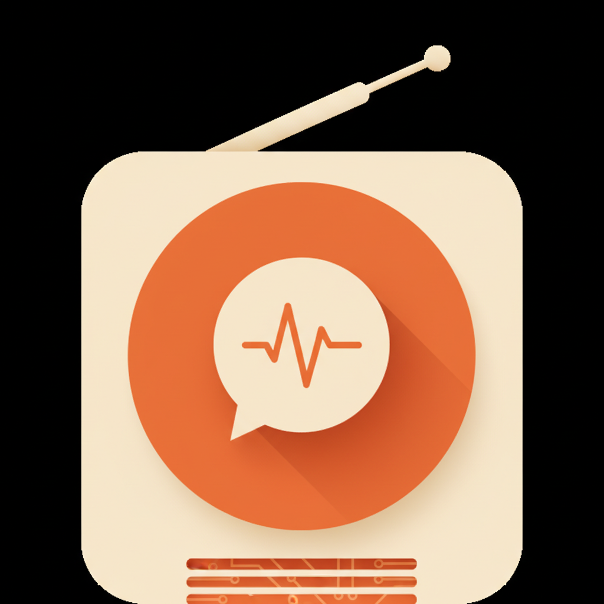

<p align="center">
  
</p>

# Booth

> The voice layer for your AI agent on Telegram.

There are already a dozen Telegram bridges for AI coding agents. Every one of them ships **text only**. Booth doesn't try to be another bridge — it drops in alongside whichever one you already use and adds **voice** on both sides.

Local TTS. Local STT. No API keys. No cloud bills. Mac menu-bar app, free forever.

## Prerequisites

Booth is the voice layer **on top of** an existing Telegram bridge — it doesn't bridge Telegram itself. Before installing Booth you need:

1. **A Mac** running macOS 13+ (Apple Silicon strongly recommended).
2. **Homebrew** installed — [brew.sh](https://brew.sh).
3. **A Telegram bot token.** If you don't have one, the [5-minute walkthrough in `docs/BOT_SETUP.md`](docs/BOT_SETUP.md) gets you one via `@BotFather`.
4. **A Telegram MCP bridge wired into your AI agent.** Booth assumes inbound text + voice messages already arrive in your agent's context via someone else's plugin. Pick one:
   - **Claude Code** *(recommended, primary supported path)*: Anthropic's official Telegram channel plugin — `claude-plugins-official` — installs in one command and exposes `<channel source="plugin:telegram:telegram">` blocks for incoming messages. Repo: [anthropics/claude-plugins-official](https://github.com/anthropics/claude-plugins-official). After install, launch your Claude Code session with `claude --channels plugin:telegram@claude-plugins-official` (the `--channels` flag is what activates the bridge). Use `/telegram:access` from inside the session to pair your phone.
   - **Codex CLI**: [TeleCodex](https://github.com/benedict2310/telecodex) is the closest equivalent.
   - **OpenClaw**: built-in Telegram skill — see [docs.openclaw.ai/channels/telegram](https://docs.openclaw.ai/channels/telegram).
   - **Custom agent**: anything that polls `getUpdates` on your bot token and feeds the message into your agent's context will work. Booth never polls — it only sends voice and transcribes audio your agent already has.

Once your agent receives Telegram messages and can reply with text, you're ready for Booth.

## Install (have an AI agent? paste this)

If you have an AI coding agent on this Mac (Claude Code, Codex CLI, OpenClaw, custom), tell it to install Booth for you. Paste this into your agent and it'll handle the rest:

> **Install Booth for me.** Repo: `https://github.com/blazemalan/booth`. Clone it, run `./install.sh`, then drop my Telegram bot token at `~/.local/share/booth/telegram_bot_token` (mode 600) and my default chat ID at `~/.local/share/booth/chat_ids` (one per line). After that, wire the `booth.md` voice protocol file so you re-read it on every incoming voice message. If you're Claude Code, just run `scripts/install_claude_hook.sh` — it sets up the UserPromptSubmit hook automatically. Codex CLI / OpenClaw / custom agents: import `~/.local/share/booth/booth.md` however your system handles agent context. Verify the install worked with `bin/booth say "hello"` (synthesizes + sends a real voice bubble) before reporting success.

The agent reads the README, runs the installer, wires the hook, sends a verification voice message, and you're done in about five minutes.

If you'd rather install by hand, jump to [Manual install](#manual-install) below.

## How it fits

You probably already have a Telegram bridge wired into your agent:

- [Claude Code Channels](https://github.com/anthropics/claude-plugins-official) — Anthropic's official MCP plugin
- [OpenClaw Telegram skill](https://docs.openclaw.ai/channels/telegram) — 8.3k+ installs
- [Ductor](https://github.com/PleasePrompto/ductor) — Claude Code + Codex + Gemini in one bridge
- [TeleCodex](https://github.com/benedict2310/telecodex) — Codex CLI bridge
- [Composio's Telegram MCP](https://composio.dev/toolkits/telegram) — generic agent bridge

These all do the same job well: they pipe text between Telegram and your local agent. Booth doesn't compete with them — Booth gives them voice.

```
[your phone]                                 [your Mac]
                                                   │
text msg ──► your bridge ────────► your agent ◄──┤
                                                   │
voice note ►► your bridge ──► booth transcribe ──►│
                                                   │
                          your agent ──► booth say ──► sendVoice ──► your phone
```

Your bridge handles the chat. Booth handles voice on both ends. They share a bot, but Booth never polls `getUpdates`, so there's no conflict.

## What it does

- **Outbound voice:** your agent calls `booth say "..."`. Booth synthesizes locally with [Kokoro-onnx](https://github.com/thewh1teagle/kokoro-onnx) on the Apple Neural Engine, encodes Opus, posts to Telegram's `sendVoice`. Your phone buzzes with a real voice bubble in ~2.5 seconds.
- **Inbound transcription:** when your bridge delivers a voice note (with the audio file path), your agent calls `booth transcribe path.oga` and gets the text from [whisper.cpp](https://github.com/ggerganov/whisper.cpp). Local, fast, free.
- **Self-trigger (Claude Code only):** `booth inject "/compact"` AppleScripts the slash command into your front Terminal session — useful when you're not at the keyboard but your agent's running long.

## Why Telegram (and not iMessage)

Telegram has a real Bot API with first-class voice-bubble support and a clean `sendVoice` endpoint. iMessage doesn't:

- No native voice bubble for bots. AppleScript sends an audio attachment, which arrives as "tap to play this file," not the proper waveform voice bubble.
- No inbound API. Receiving an iMessage programmatically means polling SQLite or wrestling with AppleScript event handlers. Brittle and slow.
- macOS TCC sandboxing keeps blocking automation paths Apple used to allow. Every macOS update is a new fight.

We may add an iMessage adapter later, but the experience will be a downgrade. Telegram is the intended channel.

## Who it's for

People running an always-on AI coding agent locally — Claude Code, Codex CLI, OpenClaw, custom Python — who already have a Telegram bridge and want to actually *talk* to their agent from anywhere.

## Manual install

```bash
git clone https://github.com/blazemalan/booth.git
cd booth
./install.sh
```

The installer:

- Downloads Kokoro TTS models (~196 MB) to `~/.local/share/kokoro-tts/`
- Downloads Whisper.cpp base model (~150 MB) to `~/.local/share/whisper/`
- Creates a runtime venv at `~/.local/share/booth/.venv` with the synth + STT deps
- Builds `Booth.app` and copies it to `/Applications/`
- Asks for your Telegram bot token (one-time)

You'll need a Telegram bot token. Two paths:

- **Already have a bot wired into your bridge?** Use the same token — Booth doesn't poll `getUpdates`, so no conflict.
- **Don't have one yet?** [Five-minute walkthrough in `docs/BOT_SETUP.md`](docs/BOT_SETUP.md).

## System requirements

- **Mac:** Apple Silicon (M1, M2, M3, M4) recommended. Intel Macs work but TTS synthesis is 3–5× slower.
- **macOS:** 13.0 (Ventura) or newer.
- **RAM:** 8 GB minimum, 16 GB recommended.
- **Disk:** ~1 GB free (models + app bundle).
- **Permissions:** Accessibility (for `booth inject`).

## Voices

Kokoro ships 50+ voices, graded A through F by the model author. Booth defaults to `af_heart` — the only A-grade voice in the roster. Swap with `--voice af_bella` etc.

## Compatibility

| Agent | `booth say` | `booth transcribe` | `booth inject` |
|-----|-----|-----|-----|
| Claude Code | ✅ | ✅ | ✅ |
| Codex CLI | ✅ | ✅ | ✅ |
| OpenClaw | ✅ | ✅ | ⚠️ (CLI mode) |
| Custom Python/CLI agent | ✅ | ✅ | ⚠️ (terminal-based only) |
| Cloud-only bots (ChatGPT web, Claude.ai) | ❌ | ❌ | ❌ |

If your agent runs locally and can shell out to a script, Booth works. The inject trick is specific to terminal-based agents that read keyboard input.

## Roadmap

- **v0.1** *(you're here)*: voice on/off ramps + self-trigger, Mac only
- **v0.2:** per-conversation voice profiles, idle-eviction tuning, log viewer in menu bar
- **v0.3:** optional iMessage adapter (downgraded UX, see "Why Telegram" above)
- **v0.4:** optional Slack/Discord adapters

Linux and Windows ports are not on our roadmap. Fork and adapt if you need them — the core is portable; the menu-bar UI and CoreML acceleration are the Mac-specific parts.

## Need help wiring this for your business?

The free repo gets you running. If you want a 1:1 working session — picking the right model, designing your agent's identity, integrating with your existing tools — Blaze takes a small number of consulting clients per month at [cinder.works/products/ai-blueprint](https://cinder.works/products/ai-blueprint).

## License

MIT. Build on it freely.

## Built on

- [Kokoro-onnx](https://github.com/thewh1teagle/kokoro-onnx) (Apache-2)
- [whisper.cpp](https://github.com/ggerganov/whisper.cpp) (MIT)
- [opus-tools](https://opus-codec.org/) (BSD-3)
- [py2app](https://github.com/ronaldoussoren/py2app) (MIT)
- [Claudible](https://github.com/blazemalan/claudible) — base scaffolding for the menu-bar app pattern (MIT)
